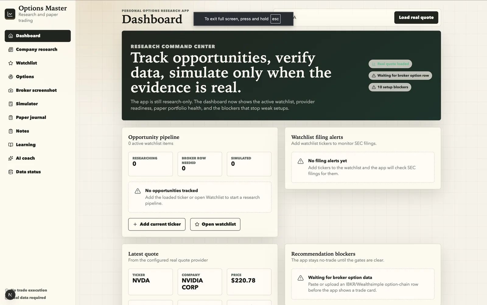
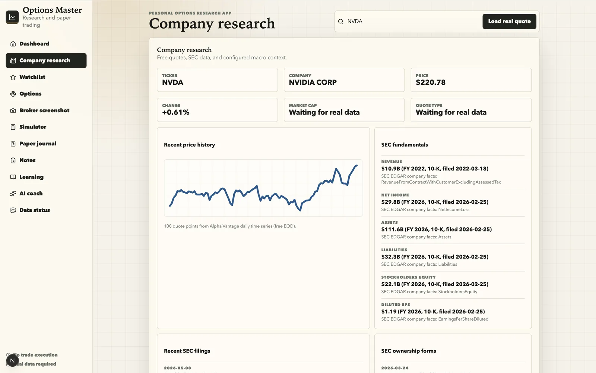
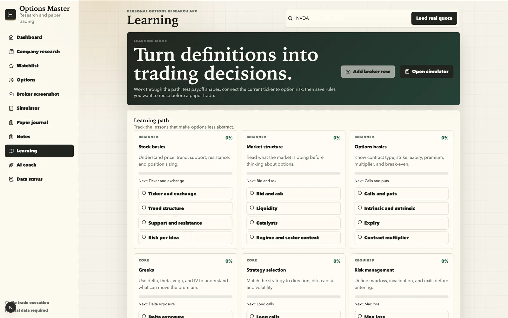
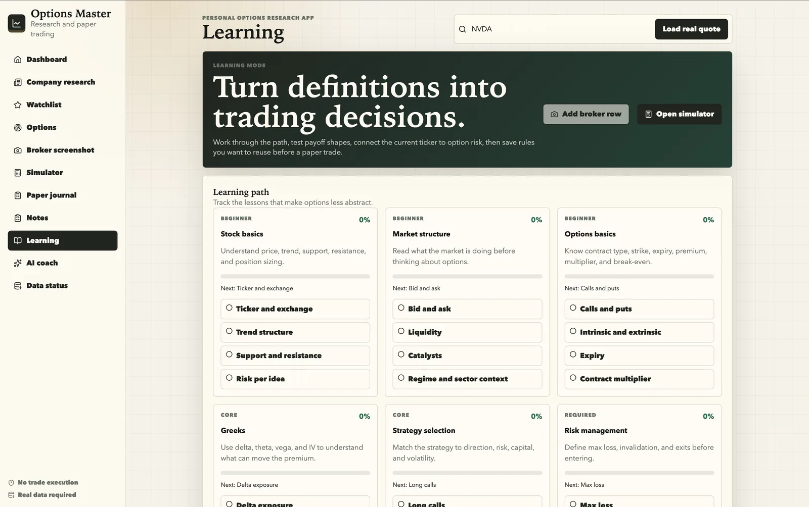
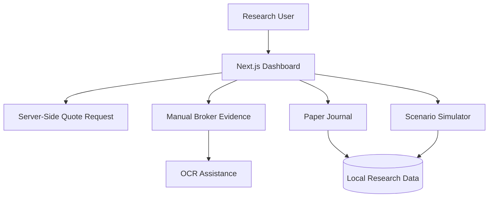

# Options Master

Personal options research, screenshot analysis, scenario simulation, and paper-journal product.

## Summary

Options Master is a private research product for studying options setups, comparing scenarios, recording broker evidence, and maintaining a paper-trading journal without placing live trades.

## Product Screenshots

| Dashboard | Company Research |
| --- | --- |
|  |  |

| Learning | AI Coach |
| --- | --- |
|  |  |

## Product Scope

- Research-only options workflow for learning, analysis, and journaling.
- Real quote data requested through a server-side market-data path.
- Broker prices, options rows, Greeks, IV, volume, and open interest captured from user-confirmed screenshots or manual rows.
- Waiting-state design for providers that are not connected yet, avoiding fake financial narratives or mock trade calls.

## User Experience

- Dashboard-oriented interface for scanning market context and research state.
- Manual evidence capture flow for broker screenshots and user-confirmed rows.
- Scenario simulation surface for comparing possible outcomes before any real decision.
- Paper-journal workflow for recording thesis, evidence, and follow-up notes.

## Key Flows

- Quote lookup flow from ticker input into server-side market data retrieval.
- Screenshot and manual-entry flow for bringing broker evidence into the research workspace.
- Scenario review flow for comparing option assumptions, risk, and payoff ranges.
- Journal flow for preserving the research trail without executing trades.

## My Contribution

- Built the application as a research-only product with explicit boundaries around trading execution.
- Structured the dashboard, market-data behavior, and evidence-first workflow.
- Removed mock market narratives so unconnected data providers remain clearly marked as waiting.
- Added validation coverage for the product's data behavior and app build.

## Stack

- Next.js
- React
- TypeScript
- Server-side market-data request path
- Better SQLite3
- Tesseract.js
- Vitest
- ESLint

## Technical Focus

- Keeps quote retrieval behind a server-side boundary instead of exposing provider logic directly in the browser.
- Separates confirmed broker evidence from disconnected or unavailable data providers.
- Uses OCR assistance for screenshot interpretation while still treating user confirmation as the source of truth.
- Preserves a research-only workflow by avoiding trade execution and avoiding generated live recommendations.

## Product Capabilities

- Server-side quote data request path for current market context.
- Manual broker screenshot and row confirmation workflow.
- Scenario simulation and paper-journal structure.
- Clear no-trade default until real evidence and providers are available.

## Architecture Overview

- Next.js frontend and server-side routes power the research dashboard.
- Local data layer supports stored research state and journal records.
- OCR-assisted screenshot workflow supports broker evidence extraction.
- Test and build gates protect the product's research-only data behavior.

## Architecture Diagram

## Highlights

- Product deliberately avoids placing trades or presenting fake live recommendations.
- Evidence-first workflow separates real broker inputs from disconnected provider states.
- Designed for repeated research sessions, comparison, and learning.

## Delivery Notes

- Built as a private product because the source includes finance-adjacent workflows and product assumptions.
- Public presentation focuses on product thinking, UX boundaries, and architecture instead of exposing source code.
- Validation includes test, lint, and build gates before source changes are published to the private repository.

## Repository Note

The source code for this product is maintained in a private repository. This page is a public product summary.
