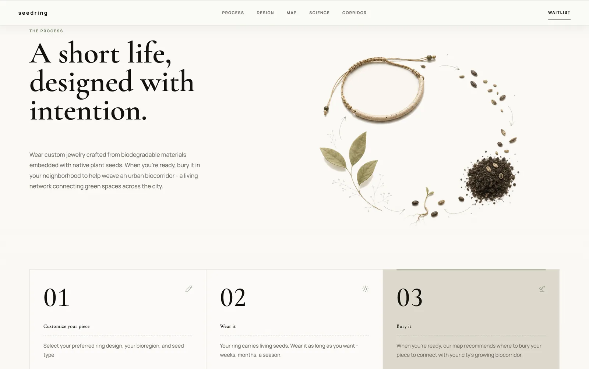
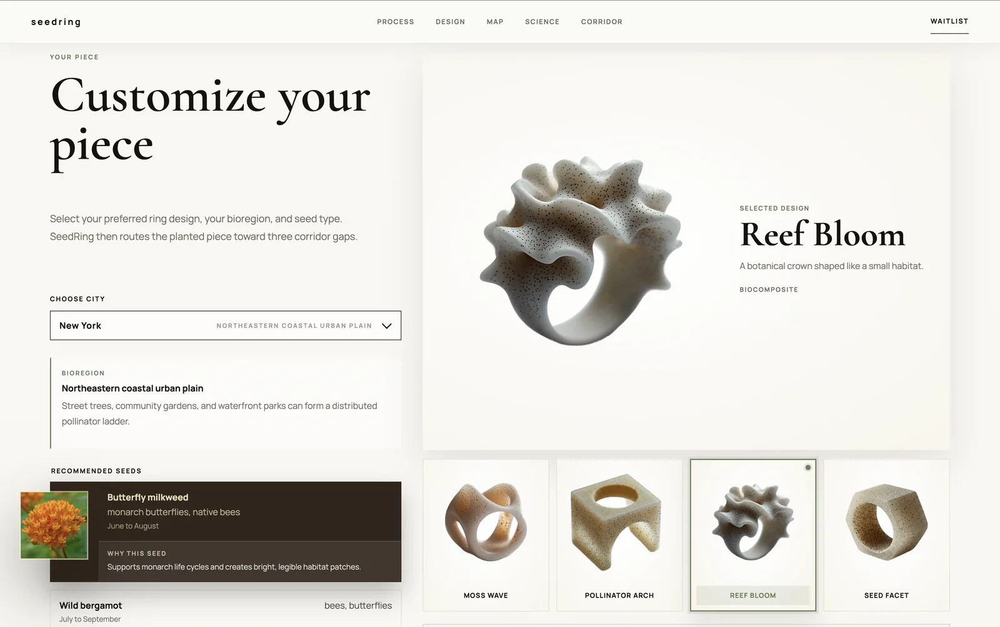
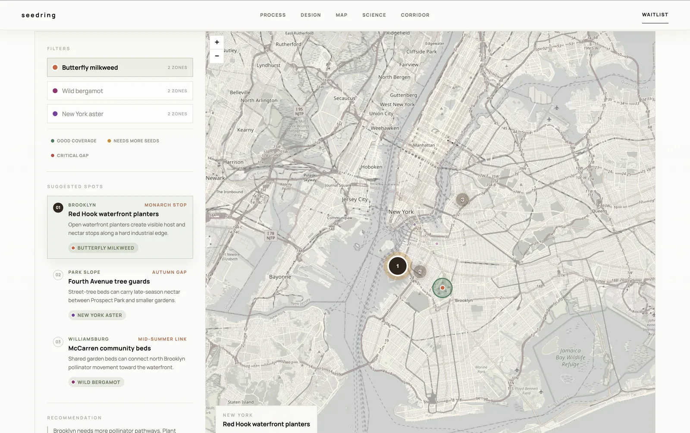
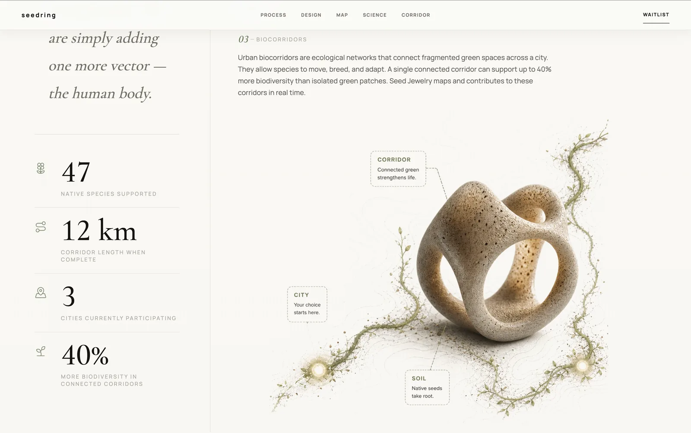
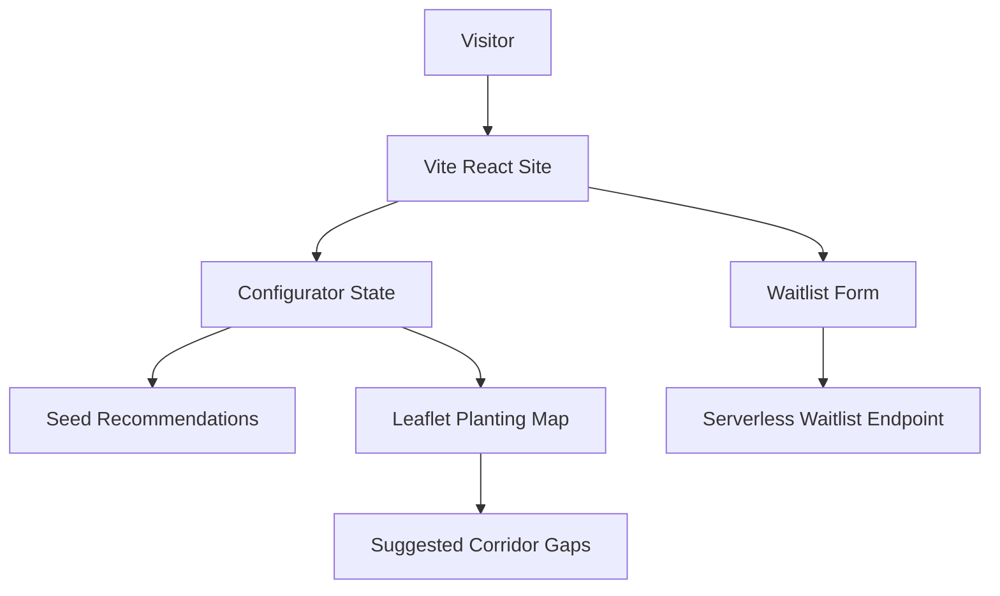

# Seed Jewelry

Biodesign jewelry concept connecting biodegradable accessories with native seed planting and urban pollinator corridors.

## Summary

Seed Jewelry is a Vite and React marketing product for SeedRing, a biodegradable jewelry concept where a wearable piece carries native plant seeds and can later be buried to support a local biocorridor.

## Product Screenshots

| Process Story | Configurator | Planting Map |
| --- | --- | --- |
|  |  |  |

| Science Section |
| --- |
|  |

## Product Scope

- Public-facing product experience for a biodesign jewelry concept.
- Interactive configurator for city, seed type, and ring design.
- Urban planting map that recommends corridor gaps for selected seeds.
- Waitlist capture flow designed for lightweight static hosting plus a serverless endpoint.

## User Experience

- Image-led landing page introducing the product story and environmental loop.
- Three-step process section explaining customize, wear, and bury.
- Configurator that updates seed rationale, flower imagery, selected ring, and product summary.
- Interactive map with seed and coverage filters, suggested planting spots, and zoom behavior tuned for page scrolling.

## Key Flows

- Product discovery flow from hero to process and configurator sections.
- Customization flow across bioregion, seed, and ring form.
- Planting recommendation flow through city-specific map filters and suggested locations.
- Waitlist flow collecting launch interest without requiring a full backend.

## My Contribution

- Built and refined the Vite / React marketing experience.
- Added responsive layout improvements, updated product copy, and integrated new visual assets.
- Implemented interactive city, seed, ring, and map behavior.
- Added Playwright coverage for copy, responsiveness, map interactions, and waitlist behavior.

## Stack

- Vite
- React
- JavaScript
- CSS
- Leaflet
- Lucide React
- Playwright

## Technical Focus

- Uses a static frontend architecture so the marketing surface can be hosted without a custom always-on backend.
- Keeps city, seed, ring, and map selections in component state for fast interactive updates.
- Uses Leaflet for the planting recommendation map and custom UI behavior for scroll-friendly zoom controls.
- Sends waitlist submissions to an environment-configured endpoint through `VITE_WAITLIST_ENDPOINT`.

## Product Capabilities

- Responsive product storytelling across desktop and mobile breakpoints.
- Seed recommendation UI with flower thumbnails and rationale copy.
- Interactive Leaflet map with custom marker and filter behavior.
- Waitlist submission wiring through `VITE_WAITLIST_ENDPOINT`.

## Architecture Overview

- Static Vite / React frontend hosts the public product experience.
- Component state drives city, seed, ring, and map filter selection.
- Leaflet powers the interactive planting map.
- Waitlist submission is designed to post to a serverless endpoint rather than a custom always-on backend.

## Architecture Diagram

## Highlights

- Product concept combines personal jewelry, biodegradable materials, and local ecological action.
- Interactive map turns the product story into a concrete planting recommendation.
- Lightweight deployment shape keeps the launch surface simple while preserving future backend flexibility.

## Delivery Notes

- Built as a private product repository because the brand, imagery, and launch concept are more valuable than exposing the source.
- Public presentation focuses on the finished product, product logic, and interaction design.
- Validation includes a production build and Playwright coverage for content, responsiveness, map behavior, and waitlist behavior.

## Repository Note

The source code for this product is maintained in a private repository. This page is a public product summary.
