# START Employability Score Application

Career preparation product delivered across mobile and web.

## Public Demo

- Demo page: [startnew.ca/projects#employability-score](https://startnew.ca/projects#employability-score)

The public demo page shows the product in context on the START Canada marketing site, including mobile app and web app preview videos. The source code remains private.

## Product Screenshots

### Web Application

| Home | Activity Dashboard | Career Dashboard |
| --- | --- | --- |
| 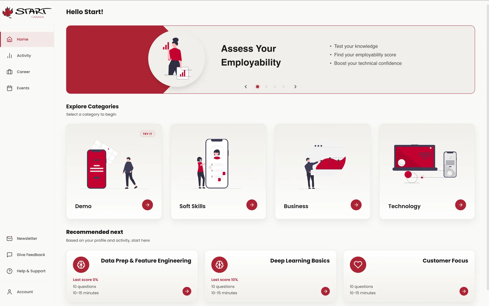 | 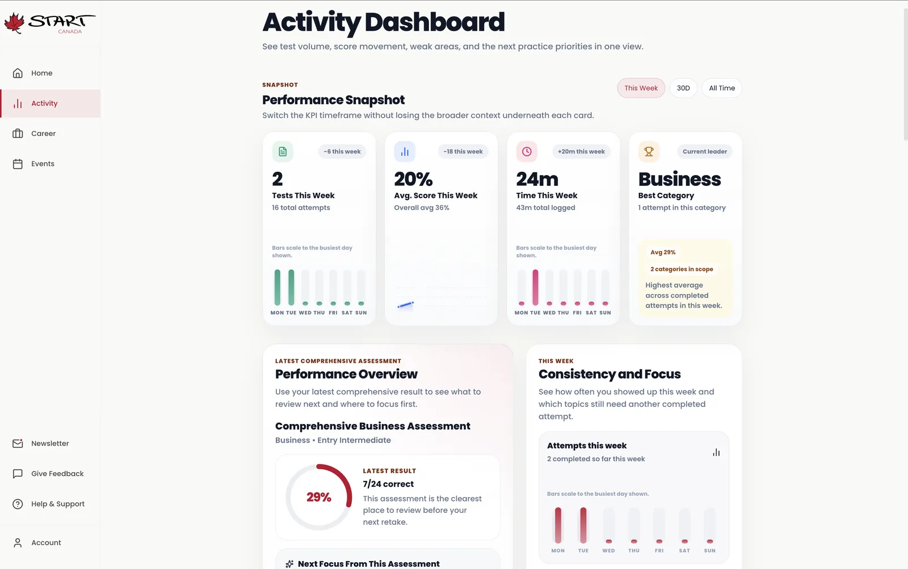 | 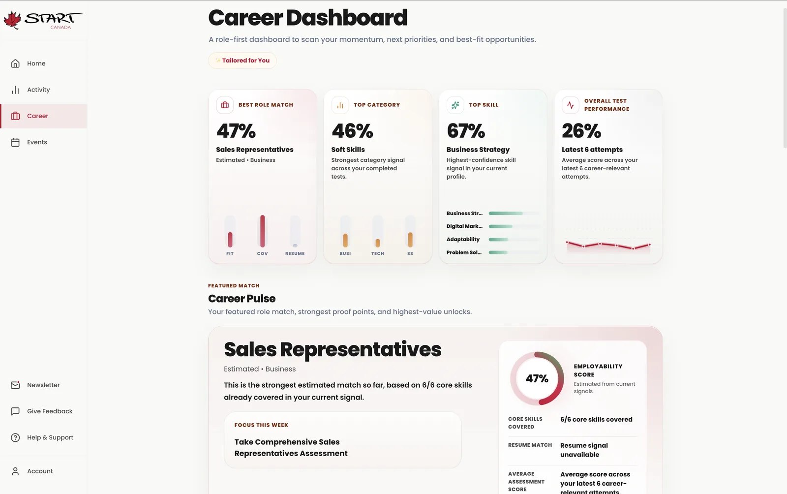 |

| Event Hub | Assessment Categories | Role Skill Path |
| --- | --- | --- |
| 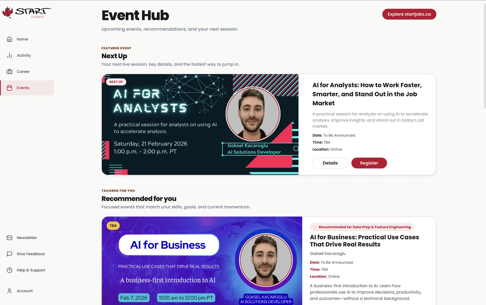 | 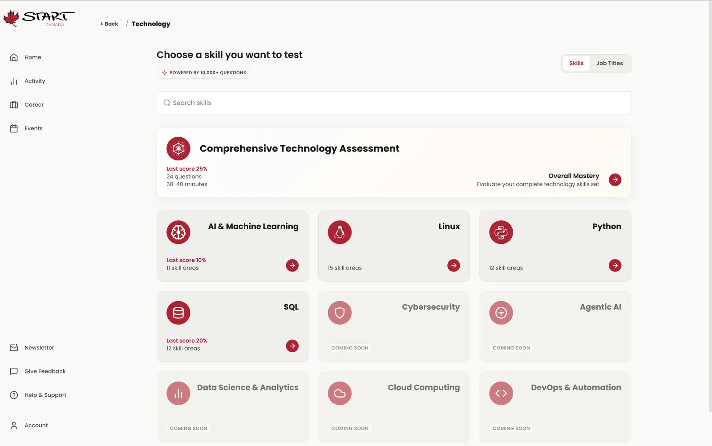 | 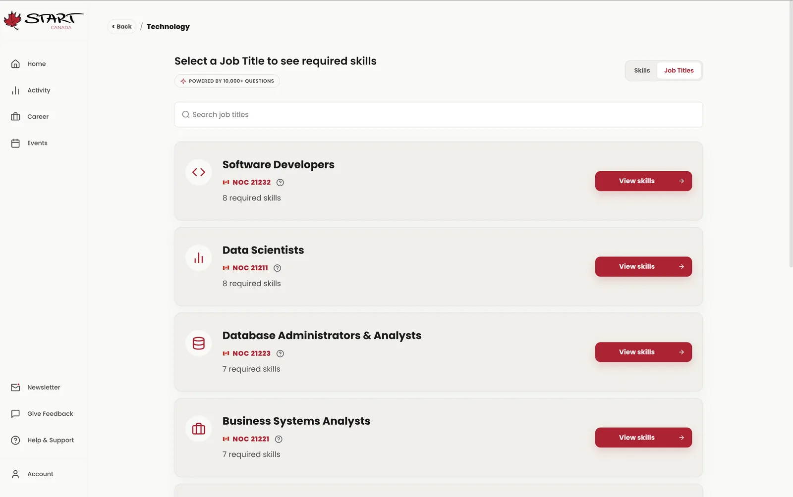 |

### Mobile Application

| Home | Event Hub | Activity | Business | Technology |
| --- | --- | --- | --- | --- |
| 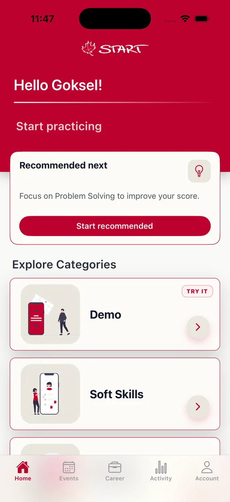 | 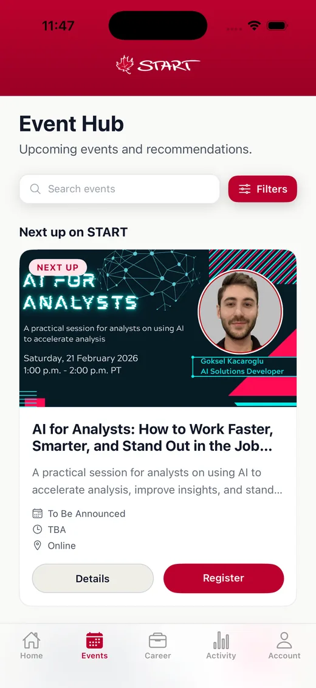 | 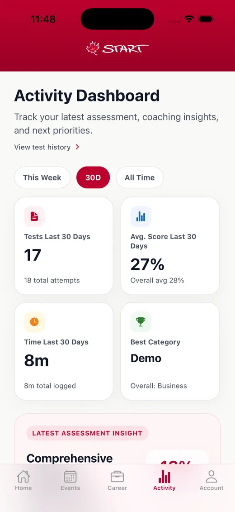 | 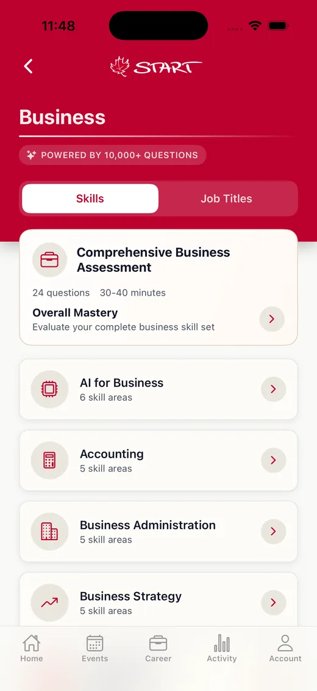 | 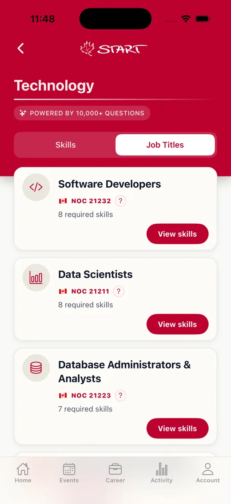 |

## Summary

START Employability Score Application is a cross-platform employability testing product that provides the same core quiz experience through both mobile and browser-based interfaces.

## Product Scope

- Cross-platform assessment product spanning mobile and web surfaces.
- Focused on employability measurement, skill discovery, and career readiness guidance.
- Designed to unify testing, progress tracking, and career-oriented recommendations in one system.

## Platform Surfaces

- Mobile application for iOS and Android through Expo / React Native.
- Web application for browser-based access through Next.js.
- Shared backend infrastructure and taxonomy model across both clients.

## User Experience

- Multi-step onboarding and authentication flows, including social sign-in support.
- Guided assessment journeys across trivia, soft skills, business, and technology categories.
- Timed quiz sessions with progress tracking, resume support, and results analysis.
- Career-facing dashboard features such as attempt history, performance review, and recommendation flows.

## Key Flows

- Onboarding and authentication flow across native and web clients.
- Assessment flow from category selection through timed quiz play and scored results.
- Results and analytics flow turning performance into strengths, gaps, and next-step guidance.
- Career support flow connecting assessment outcomes to recommendations, dashboards, and supporting documents.

## My Contribution

- Contributed to product and technical direction across the shared application experience.
- Supported delivery of the mobile and web surfaces with aligned quiz functionality.
- Worked within an AWS-backed architecture serving both application clients.
- Helped shape a product flow focused on employability assessment and career readiness.

## Stack

- React Native
- Expo
- Next.js
- React
- TypeScript
- AWS Cognito
- AWS AppSync
- AWS Lambda
- PostgreSQL
- S3 and CloudFront
- AWS CDK

## Technical Focus

- Shared product model across mobile and web so assessment behavior stays aligned between clients.
- GraphQL API layer for quiz, profile, taxonomy, analytics, and document workflows.
- Cognito-backed authentication with cloud storage for user files and supporting assets.
- CDK-managed infrastructure for repeatable environment setup and deployment.

## Product Capabilities

- Difficulty-aware assessment flows including mixed-difficulty "Test My Level" experiences.
- Results breakdowns across strengths, improvement areas, and topic-level performance.
- Career alignment features including pathway recommendations and position matching.
- Profile-level history, analytics, and document management support.
- Public demo previews for the mobile and web experiences through the START Canada marketing site.

## Architecture Overview

- React Native mobile app and Next.js web app operating from the same product ecosystem.
- AWS-backed stack using Cognito, AppSync, Lambda, PostgreSQL, S3, and CloudFront.
- Shared monorepo architecture with common UI and taxonomy packages.
- Infrastructure managed through AWS CDK with application data flowing through GraphQL APIs.

## Architecture Diagram

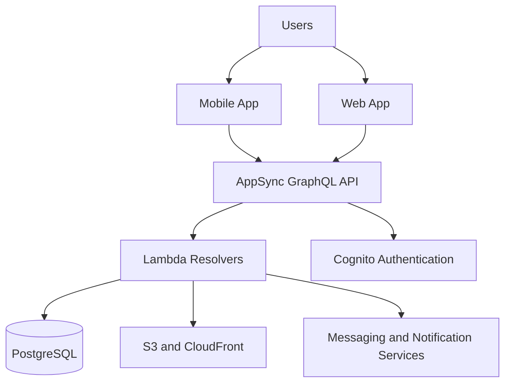

## Why This Architecture

- A shared backend and monorepo structure keeps product logic aligned across mobile and web.
- GraphQL and shared domain packages reduce duplication across quiz, profile, and analytics experiences.
- AWS-managed building blocks support secure auth, file handling, notifications, and scalable assessment delivery.

## Highlights

- Cross-platform delivery through mobile and web applications.
- Shared product logic and aligned user experience across clients.
- Career assessment workflow focused on employability testing.

## Delivery Notes

- Built as a true product platform rather than a one-off assessment tool.
- Designed around long-term user progression, repeat usage, and cross-device continuity.
- Structured to support ongoing quiz expansion, taxonomy growth, and product iteration over time.

## Repository Note

The source code for this product is maintained in a private repository. This page is a public product summary.
