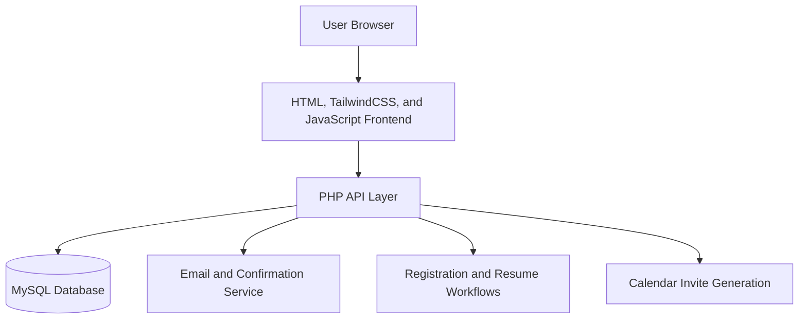

# START Jobs - Career Readiness Events Platform

Live event and registration platform built for START Canada.

## Live Product

- Website: [startjobs.ca](https://startjobs.ca/)

## Summary

START Jobs - Career Readiness Events Platform is a web application for managing career readiness bootcamps, webinars, and workshops, including registration, authentication, and email confirmations.

## Product Scope

- Event discovery and registration platform for START Canada's workshops, webinars, and bootcamps.
- Combines public event browsing with authenticated user account functionality.
- Supports both participant-facing flows and internal event management workflows.

## User Experience

- Browse upcoming events with filtering by event type and schedule.
- Register for sessions, receive confirmations, and manage attendance history.
- Access account flows including sign-up, login, password reset, and verification.
- Download calendar invites and manage registrations through a personal dashboard.

## Key Flows

- Event discovery flow from public event listings into single-event registration pages.
- Account flow covering sign-up, verification, login, password reset, and session-backed access.
- Registration flow with confirmation messaging and calendar invite delivery.
- Admin and mentor workflows for drafting, reviewing, publishing, and managing events.

## My Contribution

- Developed and maintained the event experience across frontend and backend flows.
- Supported event registration, authentication, confirmation emails, and user account features.
- Helped organize admin workflows for event creation, editing, attendance management, and mentor submissions.
- Worked on deployment and operational tooling for staging and production environments.

## Stack

- PHP
- Vanilla JavaScript
- HTML
- TailwindCSS
- MySQL / MariaDB
- Apache
- PHPMailer

## Product Capabilities

- Event registration with confirmation email flow and attendance tracking.
- User accounts with verification, password recovery, and registration history.
- Resume upload support and mentor application workflows.
- Admin-side event CRUD, draft management, attendee visibility, and capacity handling.

## Architecture Overview

- HTML and TailwindCSS frontend paired with a PHP backend and MySQL data layer.
- API endpoints for authentication, event operations, newsletter flows, and user registration data.
- Email delivery and confirmation flows integrated through PHPMailer-based messaging.
- Deployment and maintenance scripts to support staging and production operations.

## Architecture Diagram

## Highlights

- Event browsing, registration, and email confirmation workflows.
- User authentication, password reset, newsletter subscription, and resume upload support.
- Admin event management with draft states, attendee views, and capacity handling.
- Deployment scripts and environment separation for staging and production.

## Delivery Notes

- Built to support real operational event publishing rather than static event promotion pages.
- Includes both participant and internal admin workflows in a single platform.
- Structured to support staged environments, operational maintenance, and ongoing event updates.

## Repository Note

The source code for this product is maintained in a private repository. This page is a public product summary.
