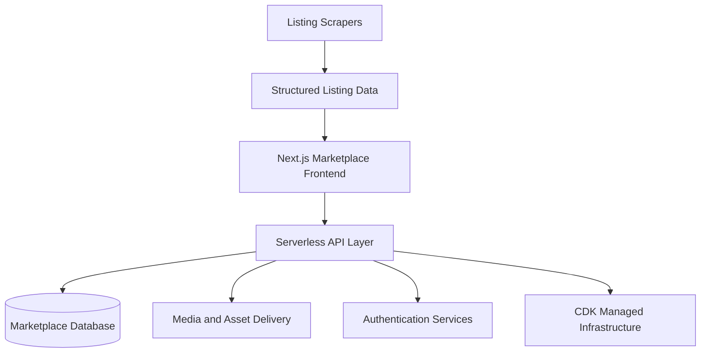

# Start Yachts - Boat Marketplace

Boat marketplace product with a web platform and supporting data pipeline.

## Summary

Start Yachts - Boat Marketplace combines scraping workflows, a Next.js frontend, backend Lambda APIs, and AWS CDK infrastructure to support a yacht-focused platform.

## Product Scope

- Marketplace-oriented product for boat and yacht listings.
- Combines listing ingestion, application delivery, and infrastructure automation in one system.
- Built to support an inventory-driven browsing experience backed by cloud services.

## Product Experience

- Web-based listing experience delivered through a Next.js frontend.
- Marketplace-style platform architecture connecting listing data, media delivery, and application routes.
- Unified dashboard direction on the frontend rather than separate legacy buyer / seller interfaces.

## My Contribution

- Worked across frontend, backend, and infrastructure layers of the platform.
- Supported the active Next.js application and associated backend services.
- Contributed to data ingestion through scraper tooling and structured output workflows.
- Helped manage AWS infrastructure through CDK-based deployment definitions.

## Stack

- Next.js
- TypeScript
- AWS Lambda
- AWS CDK
- Data scraping pipelines

## Product Capabilities

- Scraper-driven listing ingestion workflows feeding structured marketplace data.
- Serverless backend services for API and supporting business logic.
- Infrastructure-as-code deployment model for repeatable environment management.
- Documentation and operational playbooks supporting deployment and release flow.

## Architecture Overview

- Next.js frontend in front of AWS-backed APIs and media infrastructure.
- Lambda-based backend services and database tooling for marketplace operations.
- CDK-managed infrastructure spanning application, backend, and environment setup.
- Data pipeline layer for collecting and shaping listing information before presentation.

## Architecture Diagram

## Highlights

- End-to-end architecture spanning data collection, application delivery, and cloud infrastructure.
- Serverless backend services alongside a modern web frontend.
- Operational documentation and project playbooks supporting ongoing delivery.

## Delivery Notes

- Built with a full-stack product mindset rather than only a frontend marketplace shell.
- Development flow supports environment-based deployment and staged release operations.
- The product combines ingestion, application delivery, and infra ownership inside one codebase.

## Repository Note

The source code for this product is maintained in a private repository. This page is a public product summary.
